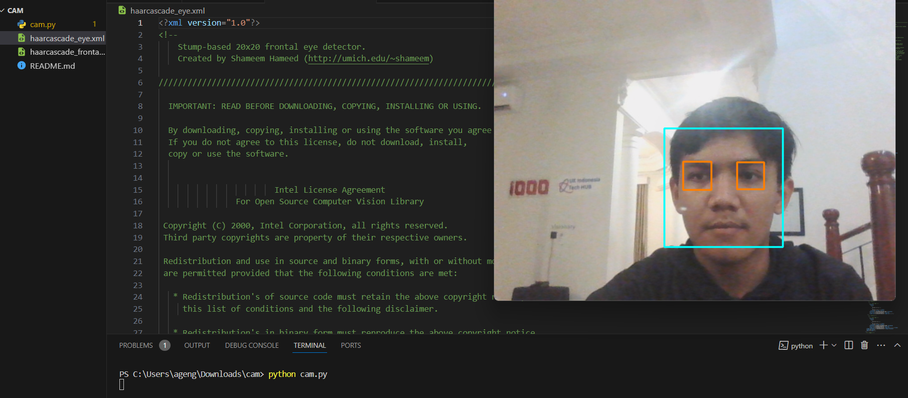

# Face and Eye Detection using OpenCV

This project demonstrates how to use OpenCV's Haar cascades to detect faces and eyes in images or video streams.

## Prerequisites

Before you begin, ensure you have met the following requirements:
* Python 3.x installed on your machine
* OpenCV installed (`opencv-python` and `opencv-python-headless` packages)
* Numpy installed

You can install the required packages using pip:
```bash
pip install opencv-python opencv-python-headless numpy
```
## our documentation
 

